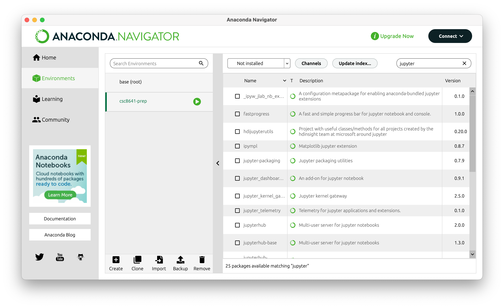

# Week 1 - Environment Setup

- [Week 1 - Environment Setup](#week-1---environment-setup)
  - [Install Anaconda](#install-anaconda)
  - [Open Anaconda Navigator](#open-anaconda-navigator)
  - [Import our Anaconda environment](#import-our-anaconda-environment)
  - [Load the environment using IPython shell](#load-the-environment-using-ipython-shell)

---

Welcome to part 1 of this session. Our goal is to setup Python so that we can get started with
Python coding.

Environment setup has traditionally been a major pain-point for Python beginners. Thankfully,
nowadays there are tools that make setting up much easier, and allow you to start writing code with
just a few clicks, regardless of which Operating System you are using. One of such tools,
particularly popular among data scientists, is [Anaconda](https://www.anaconda.com/) - an
open-source [Python distribution]((https://wiki.python.org/moin/PythonDistributions)) platform.

Besides providing the Python executable itself, Anaconda also includes
[Conda](https://conda.io/en/latest/) - an open-source source package manager and environment manager
for python projects. Conda makes it much easier to build and manage Python projects for scientific
research. For users less accustomed to the command-line, Anaconda also provides a graphical user
interface for conda, named [Anaconda
Navigator](https://docs.anaconda.com/navigator/getting-started/). We will be primarily using
Anaconda Navigator throughout this course (though using conda through the console is fine too).

In this section you will:

1. Install Anaconda (if using you're using your own computer)
2. Open Anaconda Navigator
3. Import our Anaconda environment
4. Load the environment using IPython

## Install Anaconda

- School computer - If you're on a school computer, then Anaconda should be available .
- Personal computer - If you're using you're personal computer, download the [installer](https://www.anaconda.com/products/distribution) and follow the instructions on screen.

## Open Anaconda Navigator

Once Anaconda has been successfully installed, open Anaconda Navigator. It should look like this:


There are two main Navigator tabs you will primarily interact with:

- The **Home** tab, used to open Applications available within your Environment.
- The **Environment** tab, lists your python environments and allows you to create and import new environments, or modify existing environments (namely by installing a new package or application).

Learn more about anaconda [here](https://docs.anaconda.com/anaconda/user-guide/getting-started/).

## Import our Anaconda environment

After you've got accustomed to Anaconda Navigator, you will import an existing Anaconda environment containing all the Python packages that will be used throughout this course. The environment is specified as a yaml file [here](https://github.com/NewcastleComputingScience/csc8641/blob/main/01-python-course/csc8641-prep.yaml) (you can copy the [contents](https://raw.githubusercontent.com/NewcastleComputingScience/csc8641/main/01-python-course/csc8641-prep.yaml) of this file onto a new file in your computer). Use the `Import` feature of Anaconda Navigator Environments to import this environment. You may name the environment however you wish, though I will hereafter refer to it as `csc8641-prep` so I recommend you naming it this way.

Python (virtual) environments are a toll with which to maintain isolated and self-contained python
installations and packages, so that requirements and dependencies from different projects do not
conflict with each other and wreck havoc across the system. Environments are designed to be easily
moved across machines, making your work replicable regardless of the underlying machine details.
Read more about:

- [Environments](https://www.anaconda.com/blog/moving-conda-environments)
- [Python packages](https://www.udacity.com/blog/2021/01/what-is-a-python-package.html) - a collection of reusable Python code, structured in [modules](https://packaging.python.org/en/latest/glossary/#term-Import-Package). A unit of (reusable) code is called a [module](https://docs.python.org/3/tutorial/modules.html).

Once the environment has been successfully imported, it will be listed alongside other environments and you may activate it by clicking on it.


## Load the environment using IPython shell

Next, you will load the environment using IPython shell. IPython stands for Interactive Python and
allows you to write Python code in a more user and beginner-friendly way. IPython can be executed in
two different ways: through a console application (aka terminal, shell) or Jupyter notebooks
(introduced next week).

:book: **Recommended reading**: a very useful resource to learn more about IPython (throughout this
course and beyond) is [Chapter
0](https://jakevdp.github.io/PythonDataScienceHandbook/01.00-ipython-beyond-normal-python.html) of
the [Python Data Science Handbook](https://jakevdp.github.io/PythonDataScienceHandbook/index.html)
by Jake VanderPlas.

Load your `csc8641-prep`  anaconda environment on IPython shell, using one of two approaches:

- Select "Open with IPython" when clicking on your environment. This will open IPython on your
  default console application.
- Launch the application QtConsole (*Home* tab of Anaconda Navigator). QtConsole is a more
  sophisticated IPython console, with additional features. Even though we will not be using its more
  advanced features, I recommend this approach as it will (otherwise, the default console application will vary from system to system).


Once you've done this, write your first two Python statements, as shown below:

```python
# 1. Print your first message
print("Hello world!")

# 2. Sum two numbers
1 + 2
```



Can you describe what is happening?

---

IPython resources:

- [Python Data Science Handbook](https://jakevdp.github.io/PythonDataScienceHandbook/index.html)
by Jake VanderPlas.
- [IPython website](https://ipython.org/)